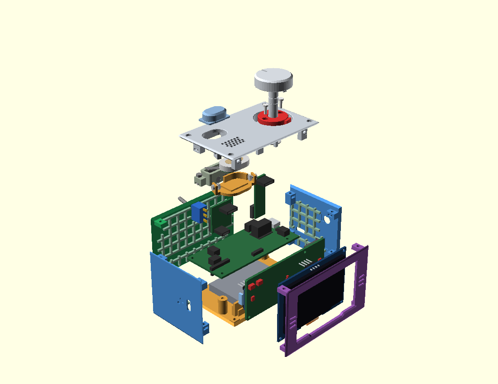
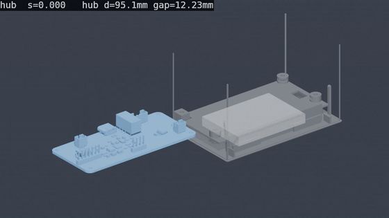
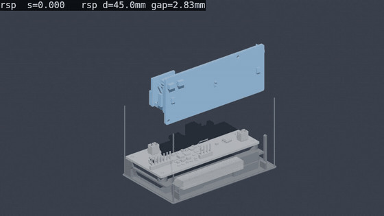
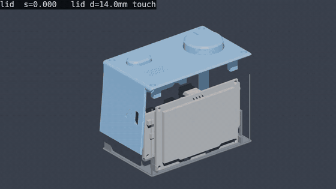

# katanori（カタノリロボ）

Gemini Live API と音声で対話する小型ロボット。**実機で会話が成立する状態まで到達済み**（2026-07-26）。
**電池で起動・会話・ミュートリレーまで通った**（2026-09-02）。

⚠ 2026-09-15 に全体を書き直した（2026-08-19 の状態のまま止まっていて、「筐体 v2 を設計中」「電池はまだ」と書いてあった）。

📖 **[かたのりの歴史](https://n416.github.io/katanori/docs/history/)** — 筐体 8 版の形と死因、燃えた・壊れた・また鏡だった事故の記録

<p align="center">
  
</p>

筐体 v6.1（レジン・板 6 枚）の分解図。天板（つまみ・会話ボタン・スピーカー）・左右の壁・フロント（紫）・床の間に、
ハブ基板 katanori61・ReSpeaker Lite・OLED・電池が入る。

**組む順の当たり検査**（`hardware/tools/sweep_movie.py`・2026-09-18）— 部品を実際の入れ方で動かし、当たりを色で出す。
青＝空き・橙＝了承済みの当たり・赤＝新しい当たり。

| ハブ基板を左の窓から差す | ReSpeaker を上から降ろす | 蓋をたわませて降ろす |
|:---:|:---:|:---:|
|  |  |  |

元の mp4 と判定の表は [docs/_img/sweep/2026-09-18-nylon/](docs/_img/sweep/2026-09-18-nylon/)。

```
[ユーザーの声]
   ↓ マイク
ReSpeaker Lite (XMOS XU316, ハードウェアAEC)
   ↓ I2S
XIAO ESP32S3 ── OLED 128x64（顔の表示）
   │                └ ハブ基板（ミュートリレー・電源・INA226・つまみ AS5600）
   ↓ WebSocket over TLS
Cloudflare Durable Object（中継・音声変換）
   ↓
Gemini Live API（音声in / 音声out）
```

## 現在の状態

| 領域 | 内容 | 状態 |
|---|---|---|
| 会話の土台 | OLEDに顔を表示 | ✅ 実機確認済み |
| 会話の土台 | Wi-Fi + WSS で Durable Object へ接続 | ✅ 実機確認済み |
| 会話の土台 | DOのPCMモード・サーバ側リサンプル | ✅ デプロイ済み |
| 会話の土台 | I2S音声の送受信 | ✅ **実機で会話成立** |
| 会話の土台 | TLS証明書の検証 | ✅ 実機確認済み |
| 会話の中身 | 現在時刻の注入 | ✅ デプロイ済み |
| 会話の中身 | つなぎ言葉（応答待ちの間を埋める） | ✅ デプロイ済み |
| 会話の中身 | 起動アナウンス（焼き込み音声） | ✅ 実機確認済み（Wi-Fi接続の約1秒後に鳴る） |
| Wi-Fi | Wi-Fiプロビジョニング（キャプティブポータル） | ✅ 実機確認済み |
| Wi-Fi | 起動後のWi-Fi自動接続 | ✅ 実機確認済み |
| Wi-Fi | 繋がらないことを画面と声で伝える | ✅ 実機確認済み |
| 耳の安全 | 起動時ノイズ対策 | ✅ ソフト側（コーデックのミュートゲート）＋ **スピーカー線のミュートリレー**の 2 段。リレーは無通電で開くので、電池切れ・クラッシュ・書き込み中は物理的にスピーカーが切れる（[docs/POWER.md](docs/POWER.md) 3章） |
| 耳の安全 | **音量つまみ（AS5600・非接触の絶対角度）** | ✅ **移行完了**（2026-08-02）。可変抵抗には戻さない。「回すとコーデックが死ぬ」は原因ごと部品が消えて解消（[docs/KNOB-ENCODER.md](docs/KNOB-ENCODER.md)） |
| 耳の安全 | ミュートリレー（無通電で開） | ✅ 駆動8項目・接点 OL/0Ω 合格（2026-08-08）→ ハブ基板に実装（2026-08-18）→ **スピーカー線で動作確認**（閉→鳴る／開→鳴らない・2026-09-02） |
| 電源 | 電池駆動（電池 → PowerBoost 直結・USB なし） | ✅ 起動・完全停止・再起動まで確認（2026-09-02）。⚠ **勝手に再起動する件**（2026-09-11・5〜15 分おき）は原因未特定。稼働時間・ピーク電流は未実測 |
| 電源 | 電池の電圧・電流の読み取り（INA226） | ✅ 実機確認済み（2026-09-02・アドレス `0x44`） |
| 電源 | 再起動の理由を残す（`boots` / `lastlog`）・30秒のウォッチドッグ | ✅ 2026-09-12 に入れた。次に再起動が起きたらこれで見る |
| 運用 | OTA更新 | ✅ 実機確認済み（2026-08-03） |
| 運用 | 利用者の設定（画面の明るさ・眠るまでの時間・起動の声・おんりょうMAX） | ✅ 会話ボタン長押しのメニュー ＋ ブラウザの `http://katanori.local/`（2026-09-11〜12） |
| 運用 | Wi-Fi 越しのシリアルコンソール（`katanori.local` の TCP 23・OTA と同じ合言葉） | ✅ 2026-09-11。筐体に入れて USB が挿せなくてもログとコマンドが届く |
| 呼びかけ | 「カタノリ」を機体の中で聞き分ける（microWakeWord・`katanori_own_a`） | ✅ 2026-09-24 完成。映画 2 時間で誤爆 0・眠りからも起きる（[docs/WAKEUP.md](docs/WAKEUP.md)） |
| 未着手 | QRペアリング | 未着手 |

### ハードウェア（いまここ）

🔒 **現フェーズは「最小単位で動かす」** — 1台が電源から会話・安全機構まで通ること。

| | 状態 |
|---|---|
| **いまの実機** | v5 の筐体（自宅のレジン）＋ ユニバーサル基板のハブ ＋ ReSpeaker Lite ＋ XIAO。2026-09-02 に電池で起動・会話・ミュートリレーまで通った。⚠ 勝手に再起動する件（2026-09-11）は原因未特定（[docs/TODO.md](docs/TODO.md) A-2） |
| **ハブ基板 v6.1（katanori61）** | ✅ 設計完了（2026-09-14）。ユニバーサル基板のハブ・PowerBoost・INA226・Type-C 基板を 1 枚に統合。DRC 0・未接続 0・`check_fab.py` 済み。**発注待ち（ユーザー判断で来月）**（[docs/PCB-V61.md](docs/PCB-V61.md)） |
| **筐体 v6.1n（MJF ナイロン・一体シェル）** | ✅ 設計完了・発注用 STL 7 点を書き出し済み（2026-09-15・`hardware/stl/v61n/`・バイナリ STL）。MJF の判定（`_stl_preflight.py --mat nylon`）で 🔴 0（[docs/CASE-V61N.md](docs/CASE-V61N.md) 5.1）。SOLIZE の自動見積りが「シェル数 129」で弾いた二重面は 2026-09-16 に直してシェルと天板を書き出し直した（同 5.3）。同日、壁厚に連動して R 1.6 に縮んでいた稜の丸みを R 2.0 に固定し、内側の角にも同心の R 0.4 を足して再度書き出した（同 5.4）。**発注待ち** |
| **筐体 v6.1（レジン・板 6 枚）** | v6.1n の元。刷らない（全部 MJF に決めた・2026-09-15） |
| **つまみ** | v6.1n で MJF・E リング 2 枚。⚠ E リングを実物で嵌めた記録はまだ無い |
| **自前の音声の板（ReSpeaker Lite ＋ XIAO の置き換え）** | ⏸ 保留（2026-09-15・量産の計画が立ったら再開）。[docs/VOICE-BOARD.md](docs/VOICE-BOARD.md) 0 章 |

**残りの全量は [docs/TODO.md](docs/TODO.md) にフェーズ順で集約してある。**

Wi-Fi未設定の機体を渡せば、スマホでQRを読む → 設定画面が自動で開く → 設定 → 会話、
という流れが通ります。設定済みの機体は、電源を入れるだけで自動でWi-Fiへ繋ぎ、
ボタンを押した時点でサーバーへ接続します（シリアルコンソールは不要）。

## リポジトリ構成

```
firmware/
├── core/          純C++14のコアロジック。Arduino依存禁止。実機とシミュレーターで共有
│                  DisplayBuffer / StateMachine / Face / RobotCore
├── hal/           IHal.h（プラットフォーム抽象）
├── esp32/         実機ファームウェア（PlatformIO）   ★詳細は firmware/esp32/README.md
│   └── src/       main.cpp / NetLink / AudioIo / Provisioning / RootCa.h
│                  Battery（INA226）/ BootLog（再起動の理由・ウォッチドッグ）/ Console（Wi-Fi 越しのシリアル）
│                  Settings（利用者の設定・katanori.local の設定ページ）/ VoiceClips.h（焼き込み音声・自動生成）
├── serlog.py      実機のシリアルを読み続けてログに落とし、cmd.txt からコマンドも送る道具
└── blank/ i2sprobe/ xmosver/   切り分け用の小さなファーム（空スケッチ＝発熱の切り分け／I2S の探り針／XMOS ファームの版数読み取り）

katanori-backend/  Cloudflare Worker + Durable Object  ★詳細は katanori-backend/README.md
├── src/           index.ts（中継とプロトコル）/ resample.ts（24k→16k）/ fillers.ts（つなぎ言葉の音源）
└── tools/         gen-fillers.mjs（つなぎ言葉）/ gen-voice-clips.mjs（実機の焼き込み音声 → VoiceClips.h）/ tts.mjs

simulator/         Windows用シミュレーター（Win32 GDI、外部lib不要）
├── win32/         main_win32.cpp
├── wrapper.py     PC上でマイク・スピーカー・DO接続を担うPythonラッパー
└── tuner.html     ロボットボイスの調整UI

hardware/          筐体・つまみ・基板の CAD（OpenSCAD）。直下の .scad は case_v5（いまの実機）・case_v6_1（レジン）・case_v6_1n（MJF・現行）
├── pcb/           KiCad の板（katanori61/ ＝ v6.1 のハブ・発注待ち。katanori61_audio/・_hub/ は保留中の音声の板）と、
│                  回路図 → 配置 → 自動配線 → 製造ファイル → 検算のスクリプト。読み方は docs/PCB-V61.md
├── parts/         部品ライブラリ（parts.scad / respeaker_lite.scad / knob_v61n・spk_v61n・btn_v61n ほか。
│                  relay_board.html ＝ いまの実機のハブ基板の穴割り）
├── icons/         刻印の元絵（SVG）と生成スクリプト
├── tools/         刷る前の検算（_stl_preflight.py は `--mat resin|nylon` で判定が変わる・stl/v61n は自動で nylon ／ _stl_clean.py）
│                  書き出し（stl_v5.py / stl_v61n.py。--check で筐体の当たり検査）／ stl_bin.py（ASCII STL → バイナリ）
├── stl/           印刷した STL（刷るぞーが読む）。v61n/ は MJF 発注用の 7 点
├── print_log.jsonl 印刷の記録（刷るぞーが書く）
├── concepts/      2026-09-13 の並べ替え案 A〜E（docs/CONCEPTS-2026-09-13.md）
├── ref/           実物の写真・ピン配置・データシート
├── sim/           MuJoCo の模型（m2_sorter/ ＝ M2 ねじ仕分けの機構、2026-09-07）
├── frozen/v1-v4/  🔒 凍結した v1〜v4 の .scad・検算・レンダー。読まない・触らない
└── frozen/v6/     v6（2026-09-12〜13・失敗）。歯車の機構と KiCad の板は次で使い回す。中身は frozen/v6/README.md

surugo/            刷るぞー — 印刷ターム（プレート 1 枚）単位で計画を立て、結果を print_log.jsonl に積む道具

docs/              設計と記録。入口は次の表
docs/manual/       組み立てマニュアル（assembly_v5.html がいまの実機。v3・v4 は履歴）
docs/history/      かたのりの歴史ページ（index.html。筐体 v1〜v6.1n と中身の節目、事故と失敗）
SPEC.md            シミュレーターの仕様
SPEC_SIM.md        同上（詳細）
仕様書.md           yorisoi-care-app との統合仕様（全体構想）
```

### docs/ の読み方

| 知りたいこと | 文書 |
|---|---|
| 何が残っているか（フェーズ順） | [docs/TODO.md](docs/TODO.md) |
| いちばん上の決定（音声モジュールとアプリの分離） | [docs/ARCHITECTURE.md](docs/ARCHITECTURE.md) |
| 現行の筐体 v6.1n（MJF）の形・検査・発注 | [docs/CASE-V61N.md](docs/CASE-V61N.md) |
| 現行のハブ基板 v6.1 に載る物 | [docs/PCB-V61.md](docs/PCB-V61.md) |
| 電源・ミュートリレー・電池 | [docs/POWER.md](docs/POWER.md) |
| 机の上で初めて電源を入れる手順 | [docs/FIRST-RUN.md](docs/FIRST-RUN.md) |
| つまみ（AS5600） | [docs/KNOB-ENCODER.md](docs/KNOB-ENCODER.md) |
| ReSpeaker Lite の形と結線 | [docs/RESPEAKER-LITE.md](docs/RESPEAKER-LITE.md) |
| 部品の寸法と出どころ | [docs/DIMENSIONS.md](docs/DIMENSIONS.md) |
| 3D プリンタ（レジン）と MJF の数字 | [docs/PRINT.md](docs/PRINT.md) |
| シミュレーター | [docs/SIMULATOR.md](docs/SIMULATOR.md) |
| 呼びかけ（ウェイクワード） | [docs/WAKEUP.md](docs/WAKEUP.md) |
| 保留中の自前の音声の板 | [docs/VOICE-BOARD.md](docs/VOICE-BOARD.md) |
| 打ち切った筐体の記録（v2〜v6） | CASE-V2 / V3 / V4* / V5-PLAN / V6-PLAN |

## 動かし方

### 実機

```bash
cd firmware/esp32
pio run -e xiao_esp32s3 -t upload
pio device monitor -e xiao_esp32s3 --port COM4   # ポートは pio device list で確認
```

ポート番号はPCごとに変わります（この機体は環境によって COM3〜COM5 になっています）。
USBドライバは不要です（ネイティブUSBなので挿すだけで見えます）。

シリアルで `?` を打つとコマンド一覧が出ます。会話は `wifi` → `c` → `1`（喋る）。
抜き差しの多い作業では `python firmware/serlog.py` がポートを待ち続けてログに落とします。
筐体に入れて USB が挿せないときは、同じ Wi-Fi から `katanori.local` の TCP 23 番（telnet・PuTTY の Raw）で
同じコンソールが使えます。2 回目からは `pio run -e xiao_esp32s3_ota -t upload` で Wi-Fi 越しに焼けます。
**詳細・配線・トラブルシューティングは [firmware/esp32/README.md](firmware/esp32/README.md)。**

### バックエンド

```bash
cd katanori-backend
npm install
npm run deploy
```

**プロトコルの詳細は [katanori-backend/README.md](katanori-backend/README.md)。**

### シミュレーター（PC単体で顔と会話を試す）

```bash
# w64devkit を PATH に前置してから
simulator\build.bat
python simulator\wrapper.py
```

顔は実機と同じ `firmware/core` が描き、DOへの接続も実機と同じPCMバイナリモード
（`?voice=Achird&pcm=16000`）を使います。**バックエンドやプロンプトの変更は、
実機へ焼く前にここで確かめられます。** 一方 I2S・AEC・Wi-Fi は実機でしか出ません。
**詳細は [docs/SIMULATOR.md](docs/SIMULATOR.md)。**

## 実機で判明した重要な事実

公式ドキュメントに書かれておらず、実機で踏んで初めて分かったものです。
**同じ罠を二度踏まないよう、詳細は各READMEに記録してあります。**

| 事実 | 詳細 |
|---|---|
| I2Sは **ESP32がスレーブ・32bitスロット**（公式サンプルはマスタ・16bit） | firmware/esp32/README.md |
| XIAO ESP32S3 は**外付けアンテナ必須**（未接続でRSSIが40dB悪化） | 同上 |
| **GPIO43 = UART0 TX = I2S DOUT**。リセット時のブートログが轟音になる | 同上 |
| **`D10`(GPIO9) は ReSpeaker Lite 側が握っている**。ミュートリレーの駆動に使うと電源投入時に閉じっぱなしになる。駆動は `D3`(GPIO4) | 同上 |
| **`D1`(GPIO2) は XMOS のリセット線**。`pinMode` 禁止 | docs/TODO.md A-4 |
| WebSocketライブラリは **15KB超のフレームで無言切断**（DO側で4KBに刻む） | katanori-backend/README.md |
| Geminiの応答は**バイナリフレーム**で届く（中身はJSON） | 同上 |
| プロビジョニングは **STA停止→スキャン→AP起動** の順でないとAPが電波に出ない | firmware/esp32/README.md |
| **スキャンでSSIDの有無は判定できない**（ステルスAPが1つでもあると「一覧に無い＝無い」が成立しない）。接続の切断理由コードを見るほうが速く確か | firmware/esp32/README.md |
| **I2Sへの直接書きは鳴らない**。再生タスクが無音を流し続ける方式のため、キュー経由以外はDMAの取り合いに負ける（beepがこれで壊れていた） | AudioIo.cpp の toneTest コメント |
| **AS5600 の GND が繋がっていないと I2C バスごと固まる**（つまみだけでなく OLED も出ない） | docs/FIRST-RUN.md「詰まったときの見分け」 |
| **XIAO の `5V` を `D10`(I2S_MCLK) に挿すとコーデックが設定されない**（音が出ないが壊れない） | 同上 |
| **INA226 のアドレスは `0x44`**（モジュールの初期値 `0x40` ではない） | firmware/esp32/src/Battery.h |

## 未着手の一覧

会話は動くが、**自立ロボットとしての土台（筐体・認証）がまだ空白**。
何が無いかは **[docs/TODO.md](docs/TODO.md)** に集約してある。
🔒 **A章＝現フェーズ（最小単位で動かす）／ B章＝人に渡す ／ C章＝フェーズ2（Stackchan）** の順で並ぶ。

## 次にやること

🔒 **いまはハードウェアの段である。ソフトの新機能は現フェーズに入っていない。**

1. **発注**（[docs/TODO.md](docs/TODO.md) A-0）— 筐体 v6.1n の MJF 7 点を JLC3DP へ（待ち無し）。
   ハブ基板 v6.1 を JLCPCB へ（ユーザー判断で来月。出す前に `hardware/pcb/check_fab.py` で在庫と価格を取り直す）
2. **勝手に再起動する原因を突き止める**（2026-09-11）— 次に起きたらシリアルで `boots` と `lastlog`
3. **稼働時間とピーク電流の実測** — 満充電から LBO が落ちるまで。ピークは次の板の昇圧を 1A にできるかの決め手
4. **音量の上限を耳で決める** — 天井 0.70 はイヤホンの頃の値。下げるだけなら設定の「おんりょうMAX」
5. **届いたら組み替える** — E リングを実物で嵌める・リードスイッチの反応距離（MJF で 0.5 遠くなった）

**その先（人に渡すため）**: 肩への固定・重量 → 認証・費用の上限・QRペアリング → 実使用者テスト。
**フェーズ2**: 遠隔モジュール（Stackchan）を BLE で足す（[docs/ARCHITECTURE.md](docs/ARCHITECTURE.md)）。

呼びかけ（「カタノリ」固定）は機体の中で聞き分けて動く。2026-09-24 に own_a で完成
（[docs/WAKEUP.md](docs/WAKEUP.md)）。⬜ **保留中**: 証明書の有効期限検証は
`CONFIG_MBEDTLS_HAVE_TIME_DATE` が無効で未検証だが、ピン留め済みなので実害は薄い。
自前の音声の板は量産の計画が立つまで保留（[docs/VOICE-BOARD.md](docs/VOICE-BOARD.md)）。

### 済んだもの

- **時刻の注入**（2026-07-26）— LLMは時計を持たず、聞かれると嘘の日時を答えていた。
  DO側で接続時に日本時間を systemInstruction へ埋める（`buildSystemInstruction()`）。
  Workers の `Date` は常にUTCなので `timeZone: "Asia/Tokyo"` の明示が必須。
- **つなぎ言葉**（2026-07-26）— 応答までの1.3秒の沈黙を埋める。DO側で完結し、
  ファームの変更は不要（`audioStreamEnd` を受けた時点で音声を先に返す）。
  音源は `katanori-backend/tools/gen-fillers.mjs` でTTS生成し `src/fillers.ts` に格納。
  **声名は実機が要求している `Achird` に合わせること**（DO既定値の `Aoede` で焼いて
  別人になった経緯あり）。詳細は katanori-backend/README.md。
- **ミュートリレー**（2026-08-03 決定 → 2026-08-08 駆動合格 → 2026-09-02 スピーカー線で確認）—
  再生中の電池切れ・ブラウンアウトで ROM ブートログが耳元で鳴る経路を、ソフトではなく接点で塞いだ。
  無通電で開くので、ファームが守っているのは「普段どおり動いているときに閉じる」だけ（[docs/POWER.md](docs/POWER.md) 3章）。
- **電池駆動**（2026-08-01 旧ボードで 20 分 → 2026-09-02 現行機で起動・完全停止・再起動）。
- **再起動の理由を残す**（2026-09-12）— 2026-09-11 夜の勝手な再起動で理由が何も残らなかったため。
  リセットの理由と直前 1 秒ごとの様子を RTC メモリに、前回の最後のログ約 3KB を `lastlog` で。固まったら 30 秒で再起動。

## 既知の弱点

- **設定用APは開放（暗号化なし）でページもHTTP。** 入力されたWi-Fiパスワードは
  設定中の数分間、近くの第三者から傍受されうる。市販IoT機器でも一般的な方式だが弱点。
- **設定ページ（`katanori.local`）に合言葉が無い。** 同じ LAN の他人が明るさや音量の上限を変えられる。
  上限より上には上げられないので耳は傷めない（Wi-Fi 越しのコンソールは OTA と同じ合言葉を最初の 1 行で求める）。
- **ルートCAをピン留めしている。** 接続先が発行元CAを変更すると繋がらなくなる。
  更新手順は `firmware/esp32/src/RootCa.h` のコメント参照。
- **耳元の音圧の上限はミュートリレーが担っている。** 再生中のクラッシュ・電池切れ・ブラウンアウトで
  コーデックが解除のまま残っても、コイルが落ちれば接点が開いてスピーカーは切れる（2026-09-02 実機確認）。
  ⚠ 接点が溶着した場合は守れない。v6 で「2 極目を使い、接点 1 つが溶着してもスピーカーの回路が切れる形にする」と決めた
  （[docs/POWER.md](docs/POWER.md)）。v6.1 の板のリレーは 2 極（G6S-2F）だが、そう配線してあるかは [docs/PCB-V61.md](docs/PCB-V61.md) に書いていない。
  音圧そのものの上限（WHO-ITU H.870 / EN 50332）は未調査。
- **勝手に再起動する**（2026-09-11・原因未特定）。起動の声が 5〜15 分おきに鳴り、電池を使い切った。
  次に起きたら `boots` / `lastlog` で理由が読める。
