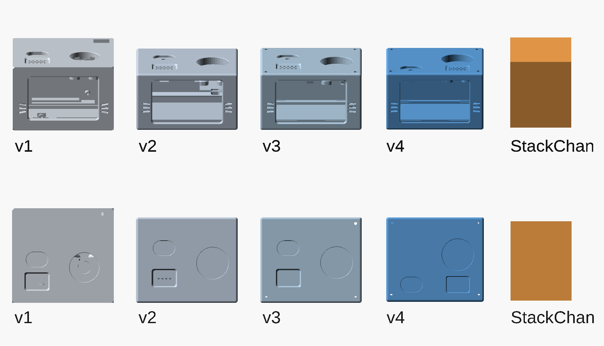

# 構成の分離（音声モジュールとアプリケーション）

この文書は katanori の**いちばん上の決定**を置く場所である。
他のすべての文書（[POWER.md](POWER.md) / [TODO.md](TODO.md) / [KNOB-ENCODER.md](KNOB-ENCODER.md) /
[RESPEAKER-LITE.md](RESPEAKER-LITE.md)）は、ここで決めた境界の下に並ぶ。

---

## 🔒 決定（2026-08-14・ユーザー）

**ReSpeaker Lite ＋ XIAO ESP32S3 を「音声モジュール」として切り離し、
アプリケーション側の MCU を別に立てる。**

音声モジュールは、マイク・AEC・スピーカー出力・Gemini との会話までを担当して、
そこで完結する。ディスプレイ・カメラ・センサー・つまみ・ボタンといった
**人と機体が触れ合う部分は、すべてアプリ側の MCU が持つ。**

⚠ **これは今までを捨てる決定ではない。** 逆で、いちばん苦労して動くようになった音声を
**完成したモジュールとして固定し、以後さわらずに済ませる**ための分離である。

## 🔒 いつ分けるか（2026-08-14・ユーザー承認）

🔴 **いますぐ分けるのではない。第1世代は今の構成のまま作り切る。**

| 世代 | 構成 | 目標 |
|---|---|---|
| **第1世代（いま作るもの）** | XIAO 1個のまま。ピンはちょうど足りている | 筐体に入れて **実使用者に渡す**（[TODO.md](TODO.md) 5章） |
| **第2世代** | **遠隔モジュール（Stackchan）を BLE で足す**（下） | 顔・表情・カメラ・サーボ。肩側は今のまま |

**なぜ今すぐ分けないのか。** **「モジュールを付ける段」の中身がまだ決まっていないからである。**
カメラで何をするかは未確定で（旧 SHOPPING.md（2026-08-24 削除・git 履歴）「先に写真で成立するか確認してから」）、
必要な解像度もフレームレートも出ていない。**要件が決まっていないモジュールのために境界を
設計すると、確実に読み違える。** 次のマイルストーンは実使用者テストであり、
そこで要るのは筐体であってカメラではない。

⚠ **作り直しの損は思ったより小さい。** 筐体は最初の1回では決まらず、実使用者の
フィードバックで必ず直すことになる。**分離のための作り直しと、そちらの作り直しは
同じ1回に乗る見込みが高い。**

### そのために第1世代でも守ること

🔒 **音声モジュールの境界を、いまから守って作る。**
XIAO から出る7本を「**音声モジュールの外部インターフェース**」として扱い、
**そこを跨ぐ配線を増やさない。**

これは追加の作業ではなく規律である。しかも分離するとつまみと表示はアプリ側へ移るので、
**この7本はむしろ減る**（5V・GND・MCU間の線が2本）。
**いまの境界は将来の上位互換になっているので、第1世代で作るものは無駄にならない。**

## なぜ分離が要るのか

理由は2つあって、どちらも**設計の好みではなく、測って出てきた事実**である。

### 1. ピンが物理的に無い

XIAO ESP32S3 が外に出しているのは `D0`〜`D10` の **11本だけ**で、そのうち
**ReSpeaker Lite 側が先に押さえているものが3本**ある。残りも会話に要るもので埋まっている。

| ピン | 誰のものか | いつ分かったか |
|---|---|---|
| `D0`(GPIO1) | 🔴 **ReSpeaker 側**。何かが 3.3V に固定している（テスター10MΩでも動かない） | 2026-08-14 |
| `D1`(GPIO2) | 🔴 **ReSpeaker 側**。XMOS のリセット線（アクティブHIGH） | 2026-08-05 |
| `D10`(GPIO9) | 🔴 **ReSpeaker 側**。XMOS の MCLK と見られる（矩形波の平均で1.49V） | 2026-08-08 |
| `D8`/`D9` | 音声（I2S） | — |
| `D4`/`D5` | I2C（OLED・AS5600） | — |
| `D2`/`D3` | 会話ボタン・ミュートリレー | — |
| `D6`/`D7` | UART | — |

**空きは実質ゼロである。** しかも 2026-08-08 に「次のピンも同じ理由で外れうる」と
書いたとおり、2026-08-14 に `D0` が予告どおり外れた。**ボードの回路図が公開されていない**
以上、残りのピンも同じ形で外れる可能性が常にある。

### 2. I2C では表示とカメラが乗らない

「増設は全部 I2C にぶら下げればよい」は**誤りである**（2026-08-14・ユーザー指摘で撤回）。
I2C はセンサーやスイッチには足りるが、**画とは桁が合わない。**

| 経路 | 320×240×16bit の1フレーム |
|---|---|
| I2C 400kHz（実効 約40kB/s） | 153KB → **約4秒/フレーム** |
| SPI 40MHz | 同じ絵で **約30ms/フレーム** |

**約150倍の差で、設定で埋まる差ではない。** 高解像度ディスプレイは SPI が要り、
そのために `SCK` `MOSI` `CS` `DC` `RST` で **4〜5本**が必要になる。上のとおり空きは0本なので、
**この機体では高解像度化そのものが選べない。** カメラも同様で、DVP か MIPI が要る。

🔴 **これは処理能力の問題ではない。ピンと帯域の問題である。**
XIAO の性能を上げても解決しない。

### つまみが音声ボードにぶら下がっているのも筋が悪い

AS5600 は本来**アプリ側の入力デバイス**であって、音声ボードの資源（I2C の2本）を
食う理由が無い。いま同居しているのは、置き場所が他に無かったからである。

## この決定で何が変わるか

| | 行き先 |
|---|---|
| マイク・AEC・スピーカー出力・I2S・XMOS | **音声モジュール側に残す。触らない** |
| 会話（Gemini Live との接続・Wi-Fi） | ⬜ **未決。** どちらが持つかで境界の重さが変わる |
| つまみ（AS5600）・会話ボタン | **アプリ側へ移す** |
| ディスプレイ | **アプリ側へ移す。** ここではじめて SPI の高解像度が選べる |
| カメラ・超音波などのセンサー | **アプリ側。** 最初からピンがある前提で選べる |
| ミュートリレー | ⬜ **未決。** 接点はスピーカー線なので音声側だが、「起動し切ってから閉じる」判断は
アプリ側かもしれない。⚠ **安全機構なので、境界をまたがせるときは無通電で開が壊れないことを先に確かめる** |
| 電源（PowerBoost・電池・EN遮断） | ⬜ **未決。** 2枚に配る形になる |

## 保留になるもの

🔴 **ハブ基板 Ver2 は組まない。**
いまの Ver2 は「全部 XIAO にぶら下げる」前提で引いてあるので、**境界が変わると位置も口も変わる。**
急いで組むと、本当に Ver3 が要る。図（[relay_board.html](../hardware/relay_board.html)）は
残しておいて、境界が決まってから引き直す。

## 捨てないもの

- **音声のファームと、そこまでの実機の実績**（実会話・OTA・つまみ・OLED）
- **ミュートリレーの回路と実測結果**（駆動8項目合格・接点 OL/0Ω）。回路そのものは有効で、
  変わるのは駆動をどちらの MCU が持つかだけ
- **AS5600 の治具と印刷物**（ホルダ・フレーム・つまみ）。センサーの帰属が変わるだけで機構は同じ
- **PowerBoost 一式と、EN遮断の設計**

## アプリ側 MCU に要るピンの数え上げ（2026-08-14）

🔒 **機種から選ばない。要るピンを先に数えてから、それを満たすボードを選ぶ。**
第1世代でピンが尽きたのは、この順番を踏まずに XIAO を前提にしたからである。

| いる場所 | 本数 | 中身 | 格付け |
|---|---|---|---|
| **A. いまの機能を移すだけ** | **6本** | | |
| I2C（SDA/SCL） | 2 | OLED `0x3C`・AS5600 `0x36`・INA226 `0x40` の3個が相乗り | ✅ 実機で動作中 |
| 会話ボタン | 1 | | ✅ 実機で動作中 |
| ミュートリレー駆動 | 1 | ⬜ どちら側が持つかは未決（上の表） | ✅ 実機で動作中 |
| 音声モジュールとの UART | 2 | TX / RX | 📄 境界の設計 |
| ステータスLED | 0 | 基板内蔵を使う（[仕様書](../仕様書.md) 71行） | ✅ |
| 電源（EN遮断） | 0 | **リードスイッチが機械的に切る。ファームは EN に触らない**（[POWER.md](POWER.md) 2章） | ✅ 決定済み |
| **B. 第2世代でやりたいこと** | | **やるなら追加** | |
| 高解像度ディスプレイ（SPI） | +5 | SCK / MOSI / CS / DC / RST | ⚠ 機種未定 |
| 超音波センサー | +2 | Trig / Echo | ⚠ やるか未定 |
| カメラ（DVP） | **+12〜14** | D0〜D7 ＋ PCLK / VSYNC / HREF / XCLK（SCCB は I2C と相乗り） | ⚠ やるか未定 |
| **C. 会話をどちらが持つか** | | | |
| 音声モジュール側が持つ | +0 | 上の UART 2本で足りる | ⬜ 未決 |
| アプリ側が持つ | +4 | I2S を境界に流す（BCLK/WS/DIN/DOUT）。加えて Wi-Fi と処理能力が要る | ⬜ 未決 |

積み上げるとこうなる。

| 構成 | 本数 |
|---|---|
| 最小（いまの機能を移すだけ） | **6本** |
| ＋高解像度ディスプレイ | **11本** |
| ＋超音波 | **13本** |
| ＋アプリ側が会話を持つ | **17本** |
| ＋カメラ（DVP） | **29〜31本** |

### この数え上げから出た結論

🔴 **XIAO 系（11本）は「最小構成＋高解像度ディスプレイ」でちょうど埋まり、余白がゼロになる。**
第1世代で刺さったのと同じ壁に、同じ形でまた当たる。**アプリ側は最低でも 20本以上
出ているボードから選ぶ。**

🔴 **カメラだけが桁違いに重い。** これを積むかどうかで、選ぶボードが 20本級か 30本級かに
分かれる。

🔒 **カメラはいずれやる（2026-08-14・ユーザー）。したがってアプリ側 MCU は最初から
30本級を選ぶ。** 20本級を選ぶ理由が無い。

⚠ **ただし、カメラ前提にすると本数とは別の条件が1つ増える。**
DVP カメラの 12〜14本は、ただの GPIO として使うのではない。**画素クロックに同期して
DMA で流し込む専用ペリフェラルが要る**（ESP32-S3 の LCD_CAM がこれに当たる）。
ソフトで叩いて代用できるものではなく、**持っていない MCU も普通にある。** 📄
**選定条件は「30本級」ではなく「カメラ用ペリフェラルを持ち、かつ 30本級」である。**

⬜ **目線カメラが肩の角度で成立するかの写真確認**（[WAKEUP.md](WAKEUP.md)「目線（カメラ）」）
**は、MCU 選定の前提条件ではなくなった。** カメラを積むことは決まっているので、
この確認が決めるのは**筐体にカメラ窓を開けるか**と、**目線起動という機能が成立するか**である。
順番としては後ろで構わない。

⚠ なお [仕様書](../仕様書.md) は「遠隔からのカメラ監視といったプライバシーリスクを排除」
と明記している。**カメラを積むとしても、それは目線での起動判定に限る**（クラウドへ送らず
機体内で判断する。[WAKEUP.md](WAKEUP.md) 83行）。この前提は動かさないこと。

## M5Stack との関係（2026-08-14）

**この機体は、作り込むほど M5Stack に似てくる。** それは自然な収束であって、失敗ではない。
画は SPI、センサーは I2C、重いものは直結、という切り分けは M5Stack が発明したものではなく、
**ハードウェアの都合がそう決めている**からである。

M5Stack の作りは3層である。①**Core** に ESP32・画面・電池・ケースが載っている。
②裏の **M-Bus（30ピン）**に ESP32 の生のピンが出ていて、SPI やカメラのような
「逃がせないもの」はここに積む。③横の **Grove ポート**は**色がそのままプロトコル**で
（赤 I2C・黒 GPIO・青 UART）、「逃がせるもの」を数珠つなぎにする。
さらに **Unit 側に小さな MCU が入っているものが多く**、複雑な処理を Unit の中で終わらせて
本体からは I2C の1デバイスに見せている。**上の「逃がす」設計を、コネクタの規格として
固定したのが M5Stack である。**

### 似てきているのは共通部品の側だけ

**katanori の独自性は、音声を専用ハードウェア（XMOS）でやることと、肩に載る大きさである。**
どちらも M5Stack 側に無い。ユーザーが Stackchan を見て katanori を始めた理由が
「大きくて重い」と「音声をソフトでやっている」だった（2026-08-14・本人）。
**この2点は今も有効で、だから音声モジュールを固定して以後さわらない、という上の決定になる。**

### 🔒 用途が違う ── 卓上と持ち出し（2026-08-27・ユーザー）

**下の比較表を読む前にこれを読むこと。**

🔒 2026-08-27、ユーザー「**StackChan はデスクトップ用ロボットで、私のは外に持ち出し用。
全く用途が違うってのを作っているうちに思った。StackChan を持ち出そうとしたら、バッテリーも
一緒に持って行かなくちゃいけなくて、手軽さが全く違うしね。そもそも筐体裏に大穴あいてるし
StackChan**」

⚠ 筐体裏の大穴は**ユーザーが実物で見た観察**である（AI は現物を見ていない）。

**2026-08-27、ユーザーが M5Stack 公式のスペック図（CoreS3 版 StackChan）を提示した。** そこで分かったこと:

- **背面は「大穴」ではなく、面ごと無い。** 図の背面写真では、基板・サーボへ行く FPC・サーボ・電池が
  そのまま外に出ている（ユーザー「後ろが全部むき出し」）。
- 🔴 **本体に 550mAh の電池が入っている**（図に `550 mAh BATTERY` の名指しあり）。

🔴 **未解決 ── 187.2g がどちらの構成か。**

| 主張 | 出どころ | 格付け |
|---|---|---|
| StackChan 187.2g は **電池抜き** | 2026-08-14・ユーザー | 📄 |
| StackChan 本体に **550mAh の電池が入っている** | 2026-08-27・M5Stack 公式スペック図（ユーザー提供） | 📄 |

**どちらも 📄 で、✅ 実測はまだ無い。** 187.2g がこの 550mAh を含む数字なら、
下の比較は **katanori 208〜216g（1000mAh）対 StackChan 187.2g（550mAh）＝ 電池込み同士**になり、
「電池を積んだ側と積んでいない側を並べていた」という上の但し書きは外れる。
⬜ **187.2g の出どころ（2026-08-14 の寸法 PDF）を開いて、どちらか確かめること。**
確かめるまで、この表の重量は**どちらの向きの主張にも使わない**。

⚠ **これは「外に持ち出すならバッテリーも要る」というユーザーの観察と矛盾しない。**
550mAh は katanori の 1000mAh の半分強で、外で使えばモバイルバッテリーを持つことになる。
🟡 **しかも StackChan はその 550mAh でサーボ 2 個を抱える**（ユーザー 2026-08-27「550mAh で
サーボで動いたら…」）。サーボは動いている間だけでなく**止まっている間も保持トルクで食う**。
⚠ サーボの消費電流は手元に数字が無く、これは未実測の読みである。
⬜ **2026-08-27 に調べたが、StackChan の稼働時間の公開実測は見つからなかった。**
M5Stack 公式ドキュメント（https://docs.m5stack.com/en/StackChan ）は 550mAh とだけ書き、
消費電流もサーボの電流も稼働時間も載せていない。第三者レビュー（https://robottesters.com/robots/stackchan/ ）は
容量を **700mAh** と書いており公式と食い違うので採らない。
🟡 440mAh 使えるとした計算で **30 分〜1 時間 45 分**（振れ幅の正体はサーボを保持し続けるかどうか）。
**これは AI の計算で、実測ではない。**比較として katanori 側は 📄 待機 200〜300mA（[POWER.md](POWER.md)）で、サーボは 1 つも載っていない。

**これは比較表の前提を書き換える。** 表は **持ち出しの構成（katanori・電池込み）と
卓上の構成（StackChan・電池抜き）を並べていた**のであって、同じ土俵の数字ではない。

| | 外へ持ち出すとき何を持つか |
|---|---|
| **katanori** | 機体 1 つ（電池は中・208〜216g がそのまま持ち出しの重さ） |
| **StackChan** | 機体 187.2g ＋ **モバイルバッテリー ＋ ケーブル**（🔴 内蔵は 550mAh ＝ katanori の半分強。上の未解決を参照） |

🔴 **したがって「重い / 軽い」は、持ち出しの構成同士では一度も比べていない。**
下の「筐体 v4 で測り直した比較」の 208〜216g 対 187.2g は、**187.2g がどちらの構成の数字か
が決まっていない**（上の 🔴 未解決）。**この行を、どちらの向きの主張にも引用しないこと。**

⚠ 2026-08-14 の記述は「61.5mm の立方体に近い形は机に置く前提でしか成立しない」まで
辿り着いていたが、そこから **「そもそも比べる相手ではない」** までは書いていなかった。
大きさと重さの表は**寸法の記録**として残す。**設計の優劣の根拠には使わない。**

⚠ これは [「🔒 遠隔モジュールは Stackchan にする」](#-遠隔モジュールは-stackchan-にする20260814ユーザー決定)
（2026-08-14 決定）を取り消すものではない。用途が違うからこそ、**卓上に置く顔・カメラ・サーボは
StackChan に任せ、肩に載る側は katanori が持つ**という分担になっている。

### 大きさの比較（判断の材料）

| | 設置面積 | 高さ | 重量 | 出典 |
|---|---|---|---|---|
| **StackChan** | 54.0 × 70.5 mm ＝ 3,807mm² | **61.5mm** | **187.2g** | 📄 M5Stack の寸法PDF（2026-08-14・ユーザー提供） |
| **katanori**（ReSpeaker Lite 基板） | 35 × 86 mm ＝ 3,010mm² | ⬜ **未確定** | ✅ **113g** | 📄 公式仕様表（[DIMENSIONS.md](DIMENSIONS.md)）／重量は 2026-08-14 実測 |

⭐ **この 74g 差は、条件としては katanori に不利な側で付いている。**

| | 筐体 | 電池 |
|---|---|---|
| StackChan 187.2g | **込み** | 🔴 **争いあり** ── 2026-08-14 ユーザー「入っていない」／ 2026-08-27 公式スペック図に 550mAh。上の 🔴 未解決 |
| katanori 113g | ❌ 含まない（未着手） | **込み**（リポ 1000mAh） |

🔴 **次の 1 文は 2026-08-27 に前提が揺れた**（上の 🔴 未解決）。当時の記述としてそのまま残す:
つまり **katanori は電池を積んだうえで 113g、StackChan は電池抜きで 187.2g** である。
StackChan 側に電池を足せば差はさらに開く。**筐体を刷った後もこの差は残る見込みなので、
「軽い」は数字で主張してよい段階に入った。**
⬜ 筐体ができたら量り直して、この行を確定させること。

⚠ **設置面積は8割で、劇的に小さいわけではない。** 長辺はむしろ katanori のほうが長い。
**決定的に違うのは高さである。** 61.5mm の立方体に近い形は**机に置く前提でしか成立しない。**
肩に載せるものは高さが出せない（重心が上がるほど傾いて落ちる）ので、薄く長い板になる。

✅ **上の ⬜ と 🔴 は 2026-08-27 に埋まった。次の節が確定値である。**

### 筐体 v4 で測り直した比較（2026-08-27）

寸法は [case_v4.scad](../hardware/case_v4.scad) の板 6 枚を `--backend=manifold` で焼いた
外皮の外接箱（`86.65 × 74.99 × 52.95`・[CASE-V4.md](CASE-V4.md) §1 と一致）。
樹脂の量は [hardware/stl/v4/](../hardware/stl/v4/) の **19 点**（つまみ 2 点を含む）を `_vol.py` で積算したもの。🆕 2026-08-29 に会話ボタンの留め板（`print_btnplate`・212mm³）が 19 点目として加わりました（重量の見積は動きません）。

| | 設置面積 | 高さ | 外形体積 | 重量 |
|---|---|---|---|---|
| **StackChan** | 54.0 × 70.5 ＝ **3,807mm²** | **61.5mm** | 234cm³ | **187.2g**（筐体込み・🔴 電池の有無は未解決） |
| **katanori v4** | 86.65 × 74.99 ＝ **6,498mm²** | **52.95mm**（箱）／ **58.45mm**（つまみ込み） | 344cm³ | 🟡 **208〜216g**（筐体・電池込みの見積） |
| 比 | **1.71 倍** | **0.86 倍**／つまみ込み **0.95 倍** | **1.47 倍** | **1.11〜1.15 倍** |

⚠ **尻尾（トグルのレバー）は箱の外に出る。** 後ろへ **34mm**・上へ **10.3mm** 伸び、
機体の実効の外接箱は `86.65 × 108.96 × 63.2` になる（`part="look"` の外接箱・実測）。
**この姿勢では高さも StackChan（61.5）を超える。**

🟡 **重量の内訳**（🟡 は実測ではない）:

| | 値 | 出どころ |
|---|---|---|
| 中身（電池込み・筐体なし） | ✅ **113g** | 2026-08-14 実測。⚠ **何を載せた状態かは記録が無い** |
| 樹脂 | 🟡 **95〜103g** | STL 実測 **86.1cm³**（板・ブリッジ・留め帯など 16 点で 80.0cm³ ＋ つまみと島 6.1cm³。支柱を含む。⚠ 犠牲タブは 2026-08-29 に外皮 6 枚から外したので、この数字はタブ 12 個ぶん 0.6cm³ だけ多い）× 比重 **1.1〜1.2**（🟡 SK本舗 Ultra 高靭性 白の実値は未確認） |
| 合計 | 🟡 **208〜216g** | |

🔴 **「電池を積んだうえで軽い」は、筐体を足した時点で成立しなくなる。**
2026-08-14 の「筐体を刷った後もこの差は残る見込み」という読みは外れた。樹脂 86cm³ は
中身とほぼ同じ重さになる。⬜ **刷ったら量ること**（比重の 1.1／1.2 の差だけで 8g 動く）。

🔴 **高さの優位も、つまみを含めるとほぼ消える。** 箱だけなら 0.86 倍だが、
天面から出る物（つまみ・会話ボタン）を入れると 58.45mm で **0.95 倍**である。
**残っている優位は形の側** ── 61.5mm の立方体に近い StackChan に対し、
katanori は 86.65 × 74.99 の板で、重心が低い。

⚠ **設置面積は 1.71 倍で、StackChan より明確に大きい。**
2026-08-14 の「8 割」は ReSpeaker 基板の裸の footprint（3,010mm²）で比べた数字であって、
箱の数字ではなかった。

⬜ **「アプリ側は作らずに買う」案がここで引っかかる。** M5Stack の Core を載せると
54 × 54mm の塊が積み上がり、Stackchan を見て感じた大きさがそのまま戻る。
**買うなら、ケースも画面も電池も付いていない基板だけのものに限る。**

### v1 → v4 の変遷（2026-08-27）

上段が正面（幅 × 高さ）、下段が上から（幅 × 奥行き）で、**5 つとも同じ縮尺**です。
どの版も `--backend=manifold` で外皮だけを焼いて外接箱を測りました
（v1 は `shell_lower()＋shell_upper()`、v2 は `both_shells()`、v3・v4 は板 6 枚の union）。
StackChan は外接箱を単なる直方体で置いてあります。

| 版 | 生まれた日 | 外寸 | 設置面積 | 外形体積 | 内寸 | 外皮の樹脂 | 印刷部品 | 外皮の分け方 |
|---|---|---|---|---|---|---|---|---|
| **v1** | 2026-08-17 | 90.00 × 84.00 × 59.21 | 7,560mm² | 447.6cm³ | 86 × 80 × 54.71 | 84.6cm³ | 6 点 | 上下 2 枚貝 |
| **v2** | 2026-08-21 | 89.99 × 75.99 × 52.60 | 6,838mm² | 359.7cm³ | 86 × 72 × 48.1 | 83.7cm³ | 8 点 | 上下 2 枚貝 |
| **v3** | 2026-08-23 | 90.00 × 75.99 × 52.95 | 6,839mm² | 362.1cm³ | 86 × 72 × 48.454 | 66.3cm³ | 13 点 | **板 6 枚** |
| **v4** | 2026-08-25 | 86.65 × 74.99 × 52.95 | 6,498mm² | 344.1cm³ | 84.354 × 72 × 48.454 | 61.6cm³ | 19 点 | 板 6 枚 |
| StackChan | — | 54.0 × 70.5 × 61.5 | 3,807mm² | 234.1cm³ | — | — | — | — |

| 版 | 対 StackChan 面積 | 対 StackChan 高さ | 対 StackChan 体積 |
|---|---|---|---|
| v1 | 1.99 倍 | 0.96 倍 | **1.91 倍** |
| v2 | 1.80 倍 | 0.86 倍 | **1.54 倍** |
| v3 | 1.80 倍 | 0.86 倍 | **1.55 倍** |
| v4 | 1.71 倍 | 0.86 倍 | **1.47 倍** |

**縮んだのは v1 → v2 の 1 回だけである。** 体積は 4 版で 447.6 → 344.1cm³（−23%）だが、
そのうち **−20% が v1 → v2** で出ている。奥行き 84 → 76（内寸 80 → 72）と高さ 59.2 → 52.6 が同時に効いた。
v2 以降の 3 版で動いたのは **−4%** だけで、v2 → v3 はむしろ +0.35mm 太っている
（`IN_Z` を PowerBoost の上端 ＋0.3 に合わせた分）。

**各版で変わったのは大きさではなく、作り方である。**

| | 何が変わったか | なぜ |
|---|---|---|
| v1 | [case_pack_front2.scad](../hardware/case_pack_front2.scad) の箱詰めスタディから起こした最初の実物。上下 2 枚貝 | ── |
| v1 → v2 | **ハブ基板を寝かせた。** 奥行き 84 → 76・高さ 59.2 → 52.6 | v1 はスピーカーで 2 回太らせていた（23 × 16 の部品に 27mm 幅の「部屋」を作った ／ ケーシング付きと知らずに受け皿を作り込んだ）。どちらもユーザー指摘で撤回 |
| v2 → v3 | **上下 2 枚貝 → 板 6 枚**（床・左右の壁・天面・フロント・ハッチ）。背面のケーブルレールを廃止 | v2 は「内寸を決めて部品を置き、線を引き、当たりを取った**後**に組む手順を確かめた」。v3 は逆に、**ユーザーが書いた組む順番を先に置いて形をそれに従わせた** |
| v3 → v4 | **PowerBoost と電池をブリッジの上へ移した。** 壁を殻に合わせて両側詰め（内寸 X 86.0 → 84.354）＝ X が初めて 90 を割った | v3 は PowerBoost を本物（ヘッダ・ハウジング・挿す軌跡）にしたら置ける場所が無く 2026-08-25 に打ち切り。「一番入れるのが面倒なピースを最後に入れようとしても入るわけがない」 |

⚠ **外皮の樹脂が v2 → v3 で 83.7 → 66.3cm³ に落ちたのは、薄くしたからではない。**
上下 2 枚貝を板 6 枚に割ったとき、ブリッジ・留め帯のような**中の構造が外皮から別部品へ出た**ためです。
v4 の印刷部品を全部足すと **80.0cm³**（外皮 61.6 ＋ 中の 8 点 15.7 ＋ 支柱。⚠ 犠牲タブは 2026-08-29 に外した）で、
v1・v2 とほぼ同じところに戻ります。**樹脂の総量は 4 版を通してほとんど減っていない。**

⭐ **代わりに減ったのは印刷時間である。** 光造形の時間は樹脂の量ではなく層数で決まり、
1 回の印刷は**そのプレートで一番背の高い部品**だけが決めています。上下 2 枚貝は
**箱の高さがそのまま印刷の背**だったので v1 が 1,145 層・v2 が 1,022 層でしたが、
板 6 枚に割った v3・v4 は一番高い天面でも **362 層**（3 分の 1）です。
数字は [PRINT.md](PRINT.md) の「印刷時間は背の高さで決まる」が持っています。

### 汎用化は M5Stack に乗る道も考えておく（2026-08-14・方針の候補）

⬜ **決定ではなく、考えておく方向として記録する**（ユーザー「〜かもって考えておくのがいい」）。

**katanori 本体は最小構成で作り切る。** ディスプレイの高解像度化・カメラ・センサー・
アクチュエーターといった汎用ロボットの方向へ広げる段は、**自前でアプリ側 MCU を起こさず、
M5Stack を使う可能性を残しておく。**

この道の利点は、**独自な部分（音声モジュールと肩に載る形）だけに手をかけられる**ことである。
汎用部品の側は作るほど M5Stack に似てくる（上）ので、そこを自作する意味が薄い。

⚠ **ただし大きさの問題は残る。** Core を載せると 54 × 54mm の塊が積み上がり、
Stackchan を見て感じた大きさが戻る。**乗るとしても、ケース・画面・電池の付いていない
基板だけのもの**に限る。この判断は、上の重量・寸法の表を根拠に行うこと。

## 🔒 遠隔モジュールは Stackchan にする（2026-08-14・ユーザー決定）

**上の「アプリ側 MCU」は、無線で切り離した遠隔モジュールのことになった。
そしてそれは Stackchan を使う。**

### きっかけになった使い方の観察（ユーザー）

**喋りかけるときに、肩からおろしたりポケットから出したりするのは普通である。**
つまり機体は常に肩にあるわけではない。**話すときだけ顔を出して机に置く。**

そこから遠隔モジュールに要るものが出た: **カメラ・モニタ・バッテリー・サーボ2。**
⭐ **これは Stackchan の部品表そのものである。**

### 最初に Stackchan を退けた理由は、両方とも消えている

ユーザーが Stackchan を見て katanori を始めた理由は2つだった（上「M5Stack との関係」）。

| 当時の理由 | いま |
|---|---|
| **大きくて重い**（54 × 70.5 × 61.5mm・187.2g） | ✅ 消えた。**肩に載せないので問題にならない。** 机に置くものとしては何の問題もない大きさである |
| **音声をソフトウェアでやっている** | ✅ 消えた。**音声は肩のモジュールが XMOS で持つ**ので、遠隔側は音声を持たない |

⚠ **したがって、この文書に一度書いた「買うならケース・画面・電池の付いていない基板だけに
限る」は取り下げる。** あれは**肩に載せる前提**で出した条件だった。遠隔モジュールなら、
**画面も電池も筐体もサーボ台座も付いているものがちょうど要るもの**である。

### この決定で「アプリ側 MCU の選定」は消える

上の「なぜ分離が要るのか」に挙げた2つの理由は、どちらも遠隔モジュール側で解決する。

| 分離が要る理由 | どうなったか |
|---|---|
| ピンが物理的に無い | ✅ **解決。** 表示もカメラも肩側に増設しないので、XIAO に空きは要らない |
| I2C では表示とカメラが乗らない | ✅ **解決。** どちらも遠隔モジュール側にある |
| つまみが音声ボードにぶら下がっているのは筋が悪い | ⬜ 残る。ただし**機能は足りている**ので、急ぎではない |

🔴 **つまり、肩側に新しい MCU を立てる必要が無くなった。** 肩側は
**いまの XIAO のままで足りる**（I2S・I2C の AS5600 と INA226・会話ボタン・ミュートリレー）。
**アプリ側 MCU を何にするかという問いは、Stackchan を選んだ時点で答えが出ている。**

⚠ 上の「アプリ側 MCU に要るピンの数え上げ」は、**肩側については用済み**である。
残すのは考え方（逃がせるもの／逃がせないものの分類）のほうで、本数の表ではない。

## 次に決めること

1. 🔴 **Stackchan をどの M5Stack で作るか。** ⚠ **カメラの有無で決まる。**
   Core Basic / Core2 にはカメラが載っていない。**カメラ入りが要るなら CoreS3、
   あるいは Core ＋ カメラユニットの組み合わせになる。** 📄 現物と入手性は未調査
2. 🔴 **2台のあいだのプロトコル。** BLE で繋ぐ。**画像は送らず、判定結果だけ送る**
   （[WAKEUP.md](WAKEUP.md)「カメラは無線で切り離す」）。何を送り合うかの一覧が要る
3. ⬜ **会話をどちらが持つか。** 音声モジュールが Gemini まで持つ前提で進むなら、
   遠隔モジュールは顔と目に専念できる。**いまの実装は音声側が持っているので、
   そのままにするのが自然である**（要確認）

⚠ **どれも今日決めなくてよい。** この文書があれば、次に開いたときに同じ場所から始められる。
